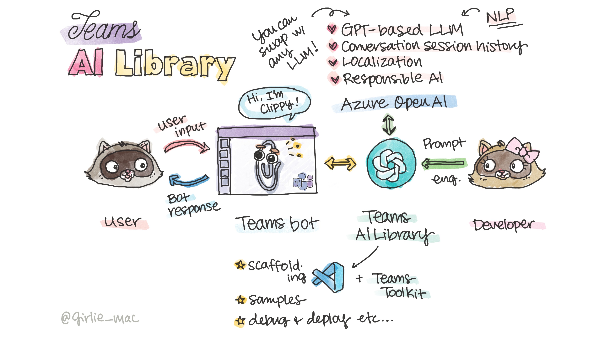

# Build Clippy for Teams with Azure OpenAI and Teams AI Library

In this section, you'll learn about building your own chatbot that channels nostalgic feels of our old friend, Clippy by giving a specific instruction with prompting. You also learn how to use Microsoft Teams AI Library to build an AI bot for Teams!

## Traditional chatbot vs. Generative AI chatbot

Traditional chatbots and Generative AI chatbots represent two different approaches to automated conversation systems. Here are the key differences:

**Traditional Chatbots:**

- **Rule-Based:** They operate on a set of predefined rules and responses. They can't generate new responses but select the closest possible answer from their database
- **Limited Flexibility:** Because they rely on a fixed set of responses, they can struggle with queries outside their programmed knowledge base
- **Specific Use Cases:** Often used in scenarios where the range of possible user queries is limited and predictable

**Generative AI Chatbots:**

- **Contextual Intelligence:** These chatbots use large language models to understand and generate responses, providing more engaging and personalized conversations
- **Learning Capabilities:** They can improve over time by learning from interactions, which allows them to handle a wider range of topics
- **Versatility:** They are not limited to predefined templates and can generate original responses, making them suitable for a broader range of applications

## Prompt engineering

Prompt engineering is a fascinating aspect of working with Generative AI chatbots. It involves crafting the input prompts to the AI in a way that guides the chatbot's responses and behavior. This can be particularly useful when aiming to give a chatbot a specific character or personality, such as Microsoft's iconic Clippy.

Here's how prompt engineering can shape a chatbot's character:

- **Defining Personality**: By including certain phrases, styles of language, and responses in the prompt, you can influence the chatbot to exhibit traits of a particular character. For Clippy, this might include a helpful but slightly overeager tone.
- **Setting Expectations**: The prompts can set the stage for how the chatbot should interact with users. For example, Clippy was known for popping up with assistance offers, so prompts could be engineered to reflect that proactive nature.
- **Guiding Responses**: Through prompt engineering, you can direct the chatbot to respond in ways that are consistent with the character's known behaviors, ensuring that the chatbot stays 'in character' during interactions.
- **Customizing Interactions**: You can tailor the chatbot's interactions based on the character's backstory or known attributes. Clippy, being a paperclip, might have prompts designed around office-related tasks and help.

Prompt engineering is not just about the initial input but also about managing the ongoing conversation to maintain the character's persona. For Clippy, this would mean creating prompts that keep the chatbot's interactions aligned with what users would expect from the quirky paperclip assistant.

## Intro Microsoft Teams AI Library

Now let's dive right into the world of AI in Microsoft Teams. You can create your very own AI chatbot right here, in Teams client.

The **Teams AI Library** is a tool designed to help you create AI-powered apps for Microsoft Teams. It provides a Teams-centric interface to GPT-based language models and user intent engines, simplifying the process of integrating conversational AI into your Teams apps. 

Here's how you can use it to create a Clippy-like bot:

- **Leverage Prebuilt Templates:** The library offers prebuilt templates that you can use as a starting point for your bot. This allows you to focus on adding your business logic rather than dealing with the complexities of conversational AI
- **Natural Language Modeling:** With GPT-powered language models, the Teams AI Library enables your bot to understand and engage in natural language conversations. You don't need to write extensive conversational logic; the library helps identify user intents and respond appropriately
Since Teams AI library uses OpenAI's GPT model, localization is available. 
- **Prompt Engineering:** You can use prompt engineering techniques to guide the conversation and give your bot a specific character, like Clippy. This involves crafting prompts that encourage the bot to respond in a way that's consistent with Clippy's helpful and quirky personality
- **Responsible AI:** The library includes built-in safety features like moderation to ensure that your bot responds appropriately in all interactions
- **Planning Engine:** A planning engine within the library helps the model identify the user's intent and maps that intent to actions that you implement. This means your Clippy bot can proactively offer help and suggestions based on the user's needs
- **Language Support:** The Teams AI Library is available in JavaScript and C# languages, giving you the flexibility to build in the language you're most comfortable with

## 🚀 Build Clippy Bot

**Now let's [build your own Clippy bot](sample/README.md)!**

## 📺 Watch on YouTube

Watch the video, **Build Clippy for Teams with Azure OpenAI and Teams AI Library** on YouTube:

[Subscribe us!](https://www.youtube.com/channel/UCV_6HOhwxYLXAGd-JOqKPoQ?sub_confirmation=1)! 