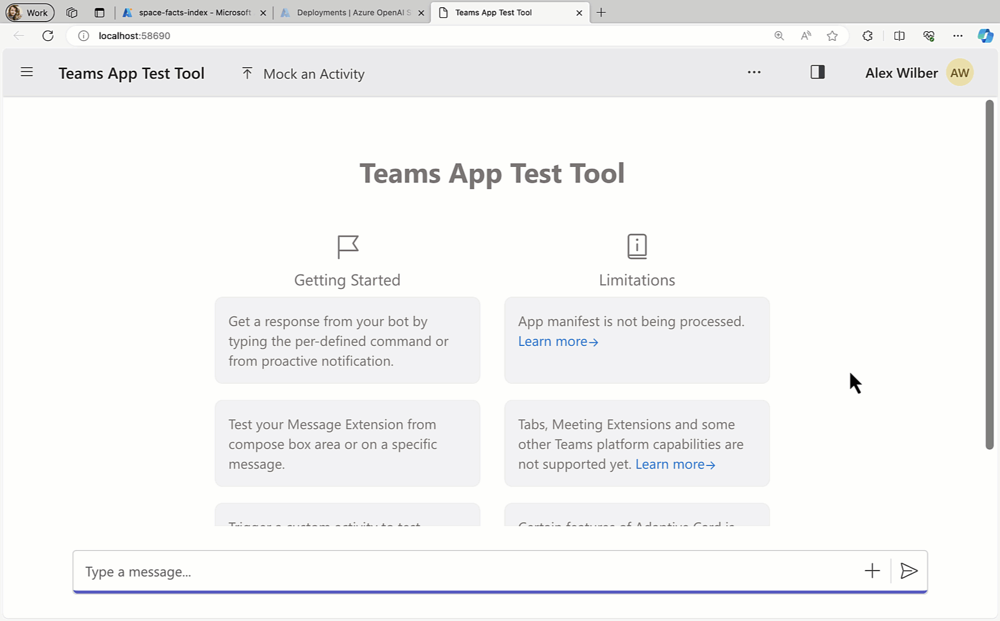

# Overview of the Space AI Search sample

This template showcases the Space AI Search sample that responds to user questions like an AI assistant according to your space data from Azure AI Search. This enables your users to talk with the AI assistant in Teams to find information.

The app template is built using the Teams AI library, which provides the capabilities to build AI-based Teams applications.

## Get started with the Space AI Search sample

> **Prerequisites**
>
> To run the sample in your local dev machine, you will need:
>
> - [Python](https://www.python.org/), version 3.8 to 3.11.
> - [Python extension](https://code.visualstudio.com/docs/languages/python), version v2024.0.1 or higher.
> - [Teams Toolkit Visual Studio Code Extension](https://aka.ms/teams-toolkit) latest version or [Teams Toolkit CLI](https://aka.ms/teamsfx-cli).
> - An account with [Azure OpenAI](https://aka.ms/oai/access).
> - An [Azure AI Search service](https://learn.microsoft.com/en-us/azure/search/search-what-is-azure-search) and an [Azure OpenAI Service](https://learn.microsoft.com/en-us/azure/ai-services/openai/how-to/create-resource).
> - [Node.js](https://nodejs.org/) (supported versions: 16, 18) for local debug in Test Tool.

### Configurations
1. Open the command box and enter `Python: Create Environment` to create and activate your desired virtual environment. Remember to select `src/requirements.txt` as dependencies to install when creating the virtual environment.
1. In **env** folder, create a file **env/.env.testtool**, and paste the following snippet in the file 
```
TEAMSFX_ENV=testtool
TEAMSAPPTESTER_PORT=56150
TEAMSFX_NOTIFICATION_STORE_FILENAME=.notification.testtoolstore.json
```
1.In **env** folder, create a file **env/.env.testtool.user**, and paste the following snippet in the file and fill the required environment variables:
   ```
   SECRET_BOT_PASSWORD=
   SECRET_AZURE_OPENAI_API_KEY='<YOUR-AZURE-OPENAI-API-KEY>'
   AZURE_OPENAI_MODEL_DEPLOYMENT_NAME='<YOUR-AZURE-OPENAI-DEPLOYMENT-MODEL-NAME>'
   AZURE_OPENAI_ENDPOINT='<YOUR-AZURE-OPENAI-ENDPOINT>'
   AZURE_OPENAI_EMBEDDING_DEPLOYMENT='<YOUR-AZURE-OPENAI-EMBEDDING-MODEL>'
    
   SECRET_AZURE_SEARCH_KEY='<YOUR-AZURE-AI-SEARCH-KEY>'
   AZURE_SEARCH_ENDPOINT='<YOUR-AZURE-AI-SEARCH-ENDPOINT>'
   ```

### Setting up index and documents
1. Open the terminal in the project root and use command `python src/indexers/setup.py` to create index and upload documents in `src/indexers/data`.
1. You will see the following information indicated the success of setup:
    ```
    Create index succeeded. If it does not exist, wait for 5 seconds...
    Upload new documents succeeded. If they do not exist, wait for several seconds...
    setup finished
    ```
1. Once you're done using the sample it's good practice to delete the index. You can do so with the command `python src/indexers/delete.py`.

### Conversation with Space AI Search
1. Select the Teams Toolkit icon on the left in the VS Code toolbar.
1. Press F5 to start debugging which launches your app in Teams App Test Tool using a web browser. Select `Debug in Test Tool (Preview)`.
1. Type "Hi" or similar and you will receive a welcome message from the bot, or send any message to get a response.

**Congratulations**! You are running the Space AI Search that can now interact with users:

